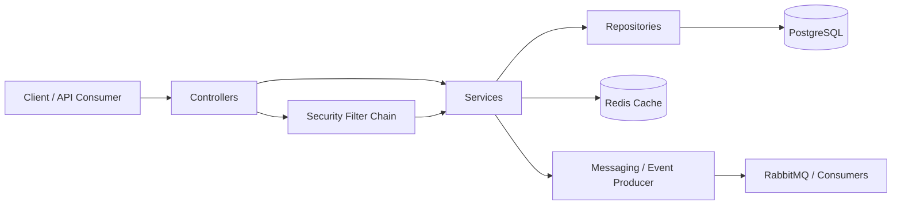

# E-Commerce Full Stack Backend

## Overview
This project is a production-minded Spring Boot e-commerce backend that demonstrates backend engineering fundamentals beyond basic CRUD APIs. It covers authentication and authorization, product and category management, cart operations, order checkout with idempotency, retry-aware payment authorization, Redis-backed caching, RabbitMQ-based messaging, and health checks.

The codebase is organized with a layered structure to keep responsibilities clear and maintainable. The main goal is to show clean service design, practical resilience patterns, and a testing approach that includes both service-level and integration-level coverage.

## Features
- User registration and login
- JWT-based authentication and role-based authorization
- Product and category management
- Product listing with pagination, sorting, and filtering
- Cart management with add/update/remove operations and total calculation
- Order creation from cart
- Idempotent checkout support with `Idempotency-Key`
- Retry-aware payment authorization (`spring-retry`)
- Redis-based caching for product read flows
- RabbitMQ event publishing and consuming for order-created events
- Health checks via root, app endpoint, and actuator endpoints
- Service and integration test coverage

## Architecture Overview
The backend follows a layered architecture:

- Controller layer: receives HTTP requests and returns API responses
- Service layer: executes business rules and cross-module orchestration
- Repository layer: handles persistence with Spring Data JPA
- Security layer: applies JWT-based authentication and role checks
- Cache layer: improves read performance for selected product queries
- Messaging layer: publishes and consumes asynchronous order events



## Main Modules
### Auth Module
Handles registration and login, password hashing, and JWT token generation.

### Product Module
Manages products with pagination, sorting, filtering, and cache-aware read endpoints.

### Category Module
Manages categories and supports product-category association.

### Cart Module
Manages cart lifecycle, item add/update/remove actions, and total calculation.

### Order Module
Creates orders from cart state, performs checkout, and protects against duplicate requests with idempotency.

### Payment Module
Runs payment authorization via gateway abstraction and retries transient failures.

### Messaging Module
Publishes `order.created` events and processes them asynchronously with a consumer.

### Health & Observability Module
Provides health endpoints and request logging support.

## Key Backend Flows
### Authentication Flow
1. A user registers with name, email, and password.
2. The password is hashed before persistence.
3. The user logs in with credentials.
4. The backend validates credentials and generates a JWT.
5. Protected endpoints require a valid bearer token.
6. Security filters validate token claims and populate authentication context.

### Cart Flow
1. The authenticated user adds a product to the cart.
2. If the item already exists, quantity is increased.
3. Cart total is recalculated from unit price and quantity.
4. Items can be updated or removed.
5. Cart state becomes the source for checkout.

### Order Flow
1. The authenticated user calls checkout with an `Idempotency-Key` header.
2. The system loads user and cart state.
3. The cart is validated to ensure it is not empty.
4. Idempotency records are checked/created to prevent duplicate order creation.
5. Payment authorization is attempted with retry on transient failure.
6. On success, order and order items are persisted.
7. Cart items are cleared.
8. An `OrderCreatedEvent` is published after transaction commit.
9. The order response is returned to the client.

### Cache Flow
1. Product read endpoints check cache first.
2. On cache hit, cached value is returned.
3. On cache miss, data is loaded from database.
4. Result is written to cache with TTL.
5. Create/update/delete product operations evict related cache entries.

### Messaging Flow
1. Successful checkout triggers order-created event creation.
2. Producer publishes event to RabbitMQ exchange.
3. Queue-bound consumers receive the event asynchronously.
4. Main request path stays focused while downstream work is decoupled.

## Tech Stack
- Java 17
- Spring Boot 3
- Spring Web
- Spring Security
- Spring Data JPA
- PostgreSQL
- Redis
- RabbitMQ (Spring AMQP)
- Spring Retry
- Spring Boot Actuator
- Maven
- JUnit 5
- Mockito
- Spring Security Test
- H2 (test profile)

## Project Structure
```text
src/main/java/com/eralp/ecommerce
├── client
├── config
├── controller
├── dto
├── entity
├── exception
├── logging
├── messaging
├── repository
├── security
├── service
└── service/impl

src/test/java/com/eralp/ecommerce
├── integration
└── service
```

## Getting Started
### Prerequisites
- Java 17
- Maven 3.9+
- PostgreSQL
- Redis (optional but required for Redis cache profile behavior)
- RabbitMQ (optional for local run, required for real messaging flow)

### Clone the Repository
```bash
git clone <repo-url>
cd back-end
```

### Configure Environment
Set environment variables using `.env.example` as reference.

### Database Setup
Create a PostgreSQL database named `ecommerce` and configure `DB_URL`, `DB_USERNAME`, and `DB_PASSWORD`.

## Environment Variables
| Variable | Description | Required | Example |
|---|---|---|---|
| `DB_URL` | PostgreSQL JDBC URL | Yes | `jdbc:postgresql://localhost:5432/ecommerce` |
| `DB_USERNAME` | PostgreSQL username | Yes | `eralpzeydan` |
| `DB_PASSWORD` | PostgreSQL password | Yes | `123` |
| `REDIS_HOST` | Redis host | No | `localhost` |
| `REDIS_PORT` | Redis port | No | `6379` |
| `RABBITMQ_HOST` | RabbitMQ host | No | `localhost` |
| `RABBITMQ_PORT` | RabbitMQ port | No | `5672` |
| `RABBITMQ_USERNAME` | RabbitMQ username | No | `guest` |
| `RABBITMQ_PASSWORD` | RabbitMQ password | No | `guest` |
| `SPRING_PROFILES_ACTIVE` | Active Spring profile | No | `docker` |

## Running the Application
```bash
./mvnw spring-boot:run
```

Run with Docker Compose (app + PostgreSQL):
```bash
docker compose up --build
```

## Running Tests
```bash
./mvnw test
```

## API Examples
### Register
```bash
curl -X POST http://localhost:8080/api/v1/auth/register \
  -H "Content-Type: application/json" \
  -d '{
    "name": "John Doe",
    "email": "john@example.com",
    "password": "Password123"
  }'
```

### Login
```bash
curl -X POST http://localhost:8080/api/v1/auth/login \
  -H "Content-Type: application/json" \
  -d '{
    "email": "john@example.com",
    "password": "Password123"
  }'
```

### Access Secured Endpoint
```bash
curl -X GET http://localhost:8080/api/v1/orders/secure-test \
  -H "Authorization: Bearer <JWT_TOKEN>"
```

### Add Item to Cart
```bash
curl -X POST http://localhost:8080/api/v1/cart/items \
  -H "Authorization: Bearer <JWT_TOKEN>" \
  -H "Content-Type: application/json" \
  -d '{
    "productId": 1,
    "quantity": 2
  }'
```

### Checkout
```bash
curl -X POST http://localhost:8080/api/v1/orders/checkout \
  -H "Authorization: Bearer <JWT_TOKEN>" \
  -H "Idempotency-Key: checkout-user1-001"
```

## Technical Decisions / Trade-offs
### Layered Architecture
The layered structure keeps boundaries clear and makes testing and maintenance more predictable.

### Idempotent Checkout
`Idempotency-Key` handling protects checkout from duplicate order creation under retries and repeated submissions.

### Retry-Aware Payment Flow
Payment authorization retries transient failures up to three attempts and returns a domain-specific temporary failure when exhausted.

### Redis Caching for Product Reads
Caching is focused on product read endpoints to improve performance while keeping invalidation simple with targeted evictions.

### H2 for Test Profile
H2 keeps test execution fast. A future improvement is adding PostgreSQL Testcontainers for closer production parity.

### Async Messaging
Order-created events are published after commit, reducing coupling between checkout and downstream processing.

## Future Improvements
- Add Testcontainers-based integration tests with PostgreSQL and RabbitMQ
- Add correlation IDs and more structured operational logging
- Add metrics dashboards and alerting for core checkout flows
- Add dead-letter and retry policies for message consumers
- Add rate limiting and additional security hardening
- Add API documentation and versioned contract testing

