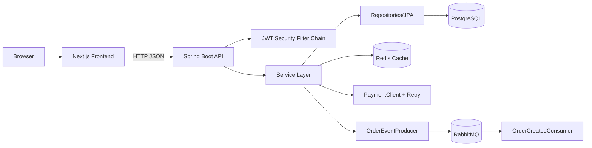

# Architecture

## System Overview
This repository is a split frontend/backend system:
- Frontend: Next.js App Router client consuming backend REST APIs.
- Backend: Spring Boot layered API with persistence, auth, caching, idempotent checkout, and messaging.

Key entrypoints:
- Frontend root layout: `front-end/src/app/layout.tsx`
- Frontend providers/interceptors: `front-end/src/app/providers.tsx`
- Backend app bootstrap: `back-end/src/main/java/com/eralp/ecommerce/EcommerceApplication.java`

## High-Level Architecture

## Frontend Architectural Style
The frontend follows a route-first + feature-first hybrid:
- Routes/layout composition in `front-end/src/app`
- Domain logic in `front-end/src/features/*`
- Shared infrastructure/UI in `front-end/src/shared/*`

Primary contract docs in repo:
- `front-end/docs/frontend-architecture-contract.md`
- `front-end/docs/api-client-layer.md`

Request flow:
`page.tsx -> feature screen -> feature hooks -> feature API wrapper -> shared/api/request -> Axios client`

Core frontend infra:
- `front-end/src/shared/api/http-client.ts`
- `front-end/src/shared/api/interceptors.ts`
- `front-end/src/shared/config/env.ts`

## Backend Architectural Style
Backend uses classic layered architecture:
- Controllers: `back-end/src/main/java/com/eralp/ecommerce/controller/*`
- Services: `back-end/src/main/java/com/eralp/ecommerce/service/*` and `service/impl/*`
- Repositories: `back-end/src/main/java/com/eralp/ecommerce/repository/*`
- Entities: `back-end/src/main/java/com/eralp/ecommerce/entity/*`

Cross-cutting layers:
- Security/JWT: `config/SecurityConfig.java`, `security/JwtAuthenticationFilter.java`, `security/JwtService.java`
- Exception mapping: `exception/GlobalExceptionHandler.java`
- Observability: `logging/RequestLoggingFilter.java`, Actuator configuration in `application.yaml`

## Core Runtime Flows

### Auth Flow
1. Register/login hit `AuthController` (`/api/auth` and `/api/v1/auth`).
2. `AuthServiceImpl` validates and persists/authenticates users.
3. JWT issued by `JwtService` on login.
4. Frontend interceptor attaches bearer token from local storage.

Files:
- `back-end/src/main/java/com/eralp/ecommerce/controller/AuthController.java`
- `back-end/src/main/java/com/eralp/ecommerce/service/impl/AuthServiceImpl.java`
- `front-end/src/features/auth/api/auth-api.ts`

### Product Browse Flow
1. `ProductsScreen` builds filters from URL search params.
2. `useProducts` calls `/api/v1/products` with pagination/sorting/filtering.
3. Backend `ProductServiceImpl` validates params and queries repository.
4. Responses cached (`products` and `product` caches).

Files:
- `front-end/src/features/products/components/products-screen.tsx`
- `front-end/src/features/products/hooks/use-product-filters.ts`
- `back-end/src/main/java/com/eralp/ecommerce/service/impl/ProductServiceImpl.java`

### Cart Flow
1. Frontend cart screen fetches `/api/v1/cart`.
2. Backend resolves authenticated user -> cart -> cart items -> totals.
3. Cart auto-created on first access.

Files:
- `front-end/src/features/cart/components/cart-screen.tsx`
- `back-end/src/main/java/com/eralp/ecommerce/service/impl/CartServiceImpl.java`

### Checkout + Idempotency + Retry + Event Flow
1. Client calls `POST /api/v1/orders/checkout` with `Idempotency-Key`.
2. `OrderServiceImpl` computes request hash and uses `IdempotencyService`.
3. On first request: creates PROCESSING idempotency record.
4. Persists order/order_items from cart.
5. Executes payment authorization via `PaymentClient` with retry (`maxAttempts=3`).
6. Clears cart items and marks idempotency SUCCESS.
7. Publishes order-created event after commit via RabbitMQ.

Files:
- `back-end/src/main/java/com/eralp/ecommerce/service/impl/OrderServiceImpl.java`
- `back-end/src/main/java/com/eralp/ecommerce/service/IdempotencyService.java`
- `back-end/src/main/java/com/eralp/ecommerce/client/PaymentClient.java`
- `back-end/src/main/java/com/eralp/ecommerce/messaging/OrderEventProducer.java`

## Security Boundaries
Main security config:
- `back-end/src/main/java/com/eralp/ecommerce/config/SecurityConfig.java`

Notable rules:
- Public: `/`, `/api/v1/health`, `/api/auth/**`, `/api/v1/auth/**`, product/category GET endpoints.
- Admin-only: product/category write endpoints, `/api/admin/**`.
- User/Admin: `/api/v1/orders/**`, `/api/v1/cart/**`.
- Everything else: authenticated.

Frontend route guard:
- `front-end/src/proxy.ts` redirects unauthenticated users from `/admin/*` to `/login` if `auth_token` cookie missing.

## Architectural Gaps / Decisions to Verify
- Register response token mismatch with frontend expectation.
  - `TODO: verify`
- Checkout payload object is currently unused by backend checkout endpoint.
  - `TODO: verify`
- No explicit stock decrement in checkout flow.
  - `TODO: verify` desired inventory behavior.
- `UserController` endpoints are authenticated but not explicitly role-restricted.
  - `TODO: verify` authorization policy.
